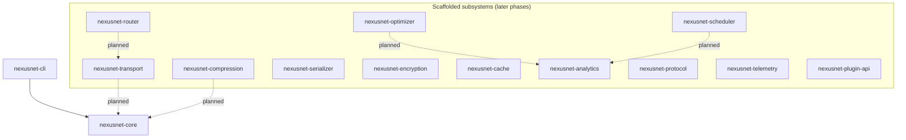
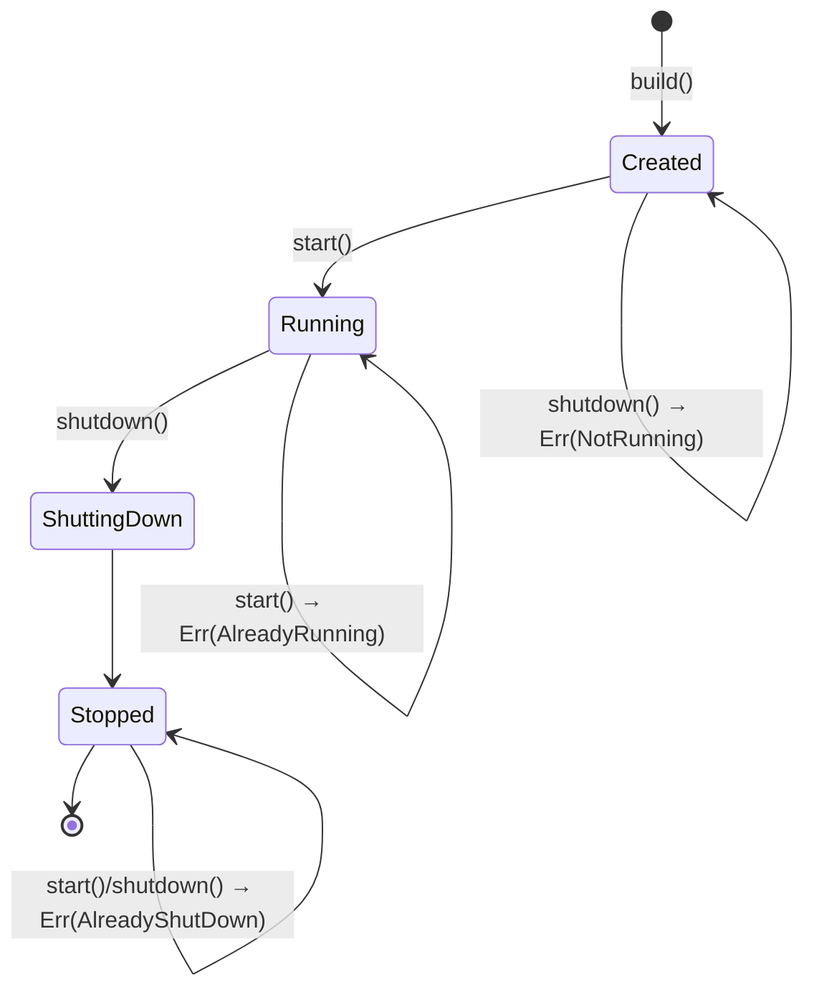
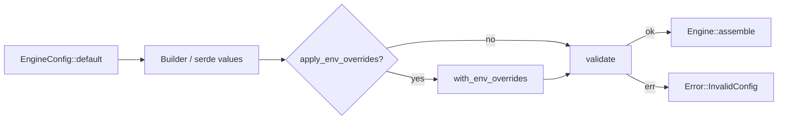

# NexusNet Architecture

This document describes the architecture established in **Phase 1**. It focuses
on the shape of the workspace and the core engine; subsystem internals are
documented in their own crates as they are implemented.

## Guiding principles

1. **One crate per subsystem.** Each concern (transport, compression, caching,
   …) is a separate crate with its own public API, tests, and benchmarks. This
   keeps compile units small, dependencies explicit, and boundaries honest.
2. **A thin, dependency-light core.** `nexusnet-core` owns only what every other
   crate needs: the engine lifecycle, configuration, errors, and logging. It
   pulls in no networking dependencies, so it compiles fast and is cheap to
   depend on.
3. **No panics on the normal path.** Fallible operations return `Result` with a
   typed `Error`. This is enforced by convention and reviewed in CI.
4. **Strict, uniform quality gates.** Formatting, Clippy (`-D warnings`), and
   tests are configured once at the workspace level and inherited by every
   crate via `[workspace.lints]` and `[workspace.package]`.

## Workspace dependency graph

Today only the CLI depends on the core; the subsystem crates are scaffolds that
will depend on `core` (and each other) as they are built out.

## The core engine

`nexusnet-core` is organized into small, single-purpose modules:

| Module      | Responsibility                                                        |
| ----------- | --------------------------------------------------------------------- |
| `engine`    | `Engine`, `EngineBuilder`, and the lifecycle state machine.           |
| `config`    | `EngineConfig`, `EngineConfigBuilder`, validation, env overrides.     |
| `error`     | The `Error` enum and `Result` alias.                                  |
| `logging`   | Global `tracing` subscriber installation.                             |
| `version`   | Compile-time version/build constants.                                 |

### Engine as a handle

`Engine` is a cheap-to-clone handle over an `Arc`-wrapped inner state. Cloning
yields another handle to the *same* engine, and all clones observe the same
lifecycle state. This is the same ownership model used by Tokio handles and most
async resources, and it lets later phases hand the engine to many tasks without
lifetime friction.

### Lifecycle state machine

The engine moves through a small, strictly ordered set of states. Illegal
transitions return a typed error instead of panicking.

### Configuration flow

Configuration composes three sources, in increasing precedence: defaults, then
builder/file values, then environment overrides.

Because `EngineConfig` derives `serde::Serialize`/`Deserialize`, TOML and YAML
file loading are a thin layer to be added in a later phase without touching the
validation or override logic.

## Error handling

All fallible operations return `nexusnet_core::Result<T>`, an alias for
`Result<T, nexusnet_core::Error>`. `Error` is built with `thiserror`, is
`#[non_exhaustive]`, and carries structured context (e.g. the offending config
field or environment variable) rather than opaque strings alone.

## Observability

Logging is built on `tracing`. `logging::init` installs a process-global
subscriber whose format (`full`, `compact`, `pretty`, `json`) and filtering
follow the configuration, while still honoring the standard `RUST_LOG`
environment variable when present. Metrics and distributed tracing export are
owned by the `telemetry` crate in a later phase.
